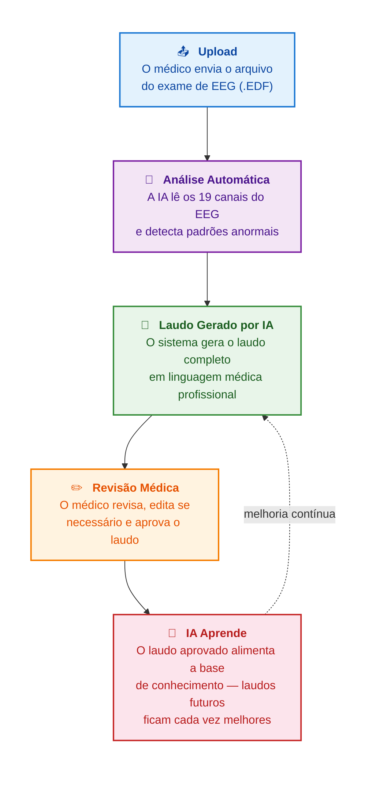
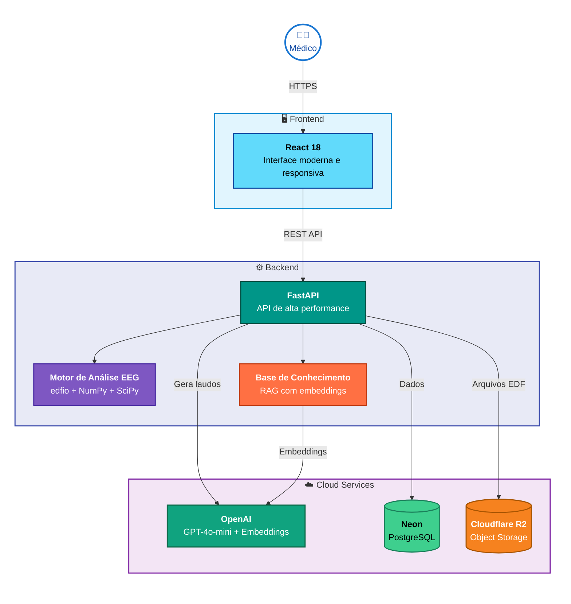
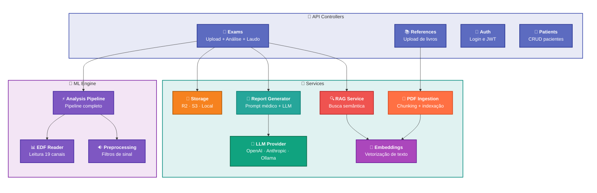
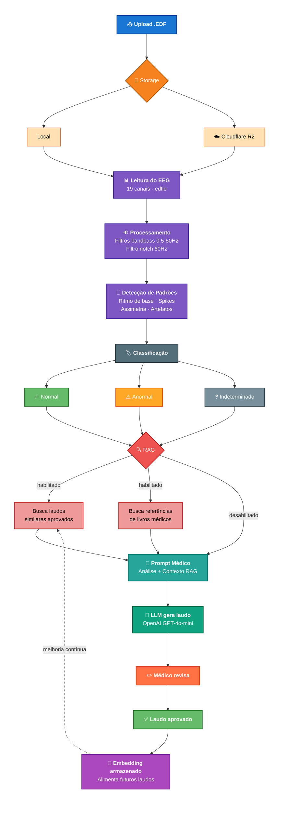
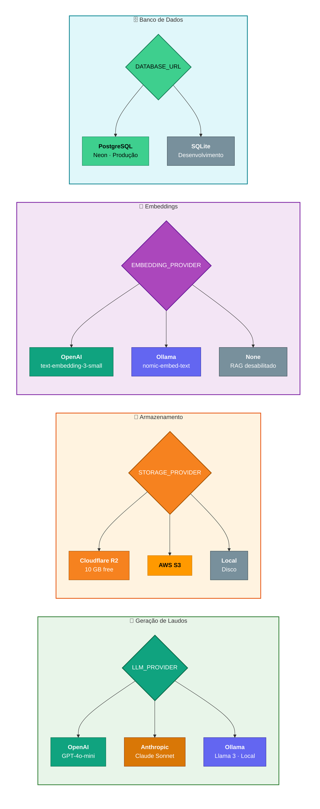
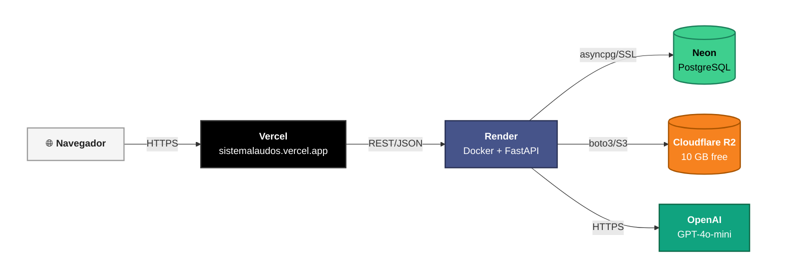
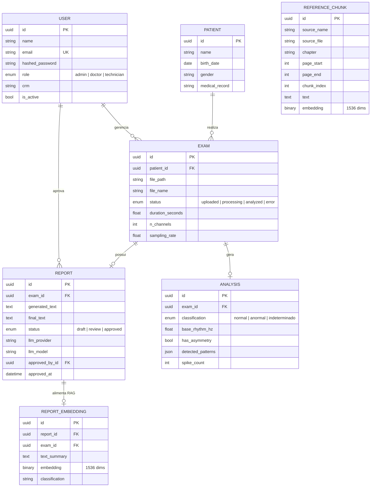
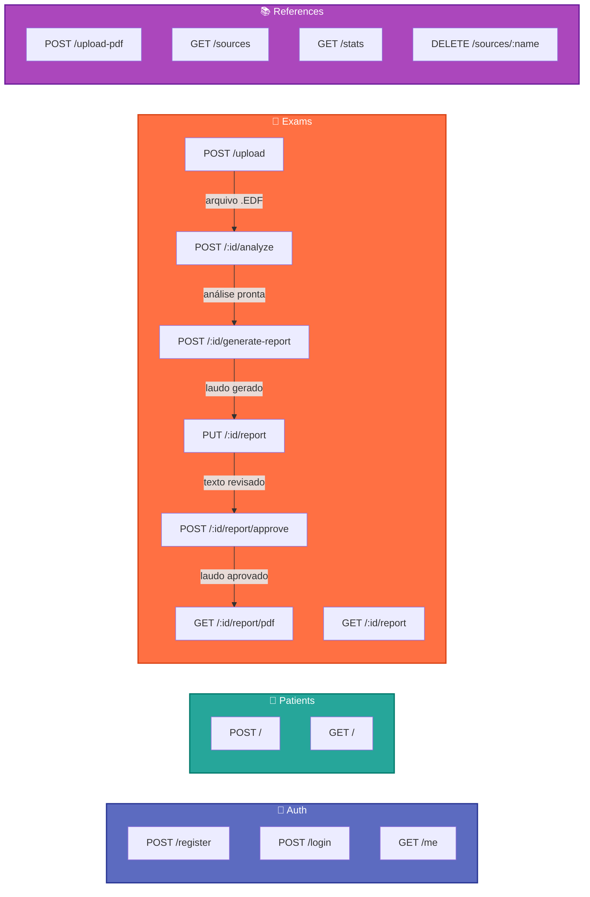

# 🧠 Sistema de Laudos EEG com IA

### Geração automatizada de laudos de Eletroencefalograma com Inteligência Artificial

<br/>

> **Projeto full-stack** que combina processamento de sinais biomédicos, IA generativa (LLM) e RAG (Retrieval-Augmented Generation) para automatizar a elaboração de laudos de EEG — com aprendizado contínuo a partir da prática do médico.

<br/>

| | |
|---|---|
| **Backend** | Python 3.12 · FastAPI · SQLAlchemy 2.0 · asyncpg |
| **Frontend** | React 18 · Vite 5 · Axios |
| **IA** | OpenAI GPT-4o-mini · RAG com Embeddings |
| **Infra** | Render (Docker) · Vercel · Neon PostgreSQL · Cloudflare R2 |
| **Padrões** | Strategy Pattern · Async/Await · JWT Auth · S3-compatible Storage |

---

## 🎯 Como funciona — Visão para não-técnicos

O fluxo completo em 5 passos simples:



> **Diferencial:** Cada laudo aprovado pelo médico é armazenado como referência. Quanto mais o sistema é usado, mais os laudos se alinham com o estilo e padrão do profissional.

---

## ☁️ Arquitetura Cloud — Serviços e Integrações

Visão geral de todos os serviços e como se comunicam:



**Decisões de arquitetura:**

| Serviço | Escolha | Por quê |
|---|---|---|
| 🤖 IA | **OpenAI** (GPT-4o-mini + Embeddings) | Uma única API key serve LLM e embeddings |
| 🗄️ Banco | **Neon** PostgreSQL | Serverless, free tier generoso, asyncpg |
| 💾 Storage | **Cloudflare R2** | 10 GB grátis, S3-compatível, sem egress fees |
| 🚀 Backend | **Render** (Docker) | Deploy automático via GitHub push |
| 🖥️ Frontend | **Vercel** | Deploy estático otimizado para React |

---

## 🔧 Componentes Internos do Backend

Cada módulo e suas dependências dentro da API:



---

## ⚡ Pipeline Técnico — Fluxo Completo Detalhado

Do upload do arquivo ao aprendizado contínuo, com todas as decisões do sistema:



---

## 🔌 Provedores Plugáveis — Strategy Pattern

Tudo parametrizável via variáveis de ambiente. Troque de provedor sem alterar uma linha de código:



---

## 🚀 Deploy em Produção

Pipeline de deploy e comunicação entre os serviços hospedados:



| Serviço | URL | Status |
|---|---|---|
| Frontend | [sistemalaudos.vercel.app](https://sistemalaudos.vercel.app) | ✅ Live |
| Backend API | [eeg-laudos-api.onrender.com](https://eeg-laudos-api.onrender.com) | ✅ Live |
| Swagger Docs | [/docs](https://eeg-laudos-api.onrender.com/docs) | ✅ Live |
| Health Check | [/api/health](https://eeg-laudos-api.onrender.com/api/health) | ✅ Live |

---

## 🗄️ Modelo de Dados



---

## 📡 API Endpoints



---

## 🧪 Testes E2E

O sistema possui **dois níveis de testes** que rodam contra **produção real**:

| Tipo | Ferramenta | Testes | O que valida |
|---|---|---|---|
| **API** | Python + httpx | 24 | Backend endpoints (auth, CRUD, RAG, CORS, segurança) |
| **UI** | Playwright + Chromium | 40 | Frontend completo (login, navegação, botões, formulários, PDF) |

Ambos validam a aplicação **em produção** (Render + Vercel), garantindo que deploy, build, banco, storage e LLM estão funcionais.

```bash
# Testes de API
python test_e2e_prod.py --verbose

# Testes de UI (frontend)
cd frontend
npm run test:e2e            # headless
npm run test:e2e:headed     # com browser visível
```

---

<br/>

<div align="center">

**Feito com** FastAPI · React · OpenAI · PostgreSQL · Cloudflare R2

Diagramas renderizados com [Mermaid.js](https://mermaid.js.org/) — compatíveis com GitHub, GitLab e VS Code.

</div>
