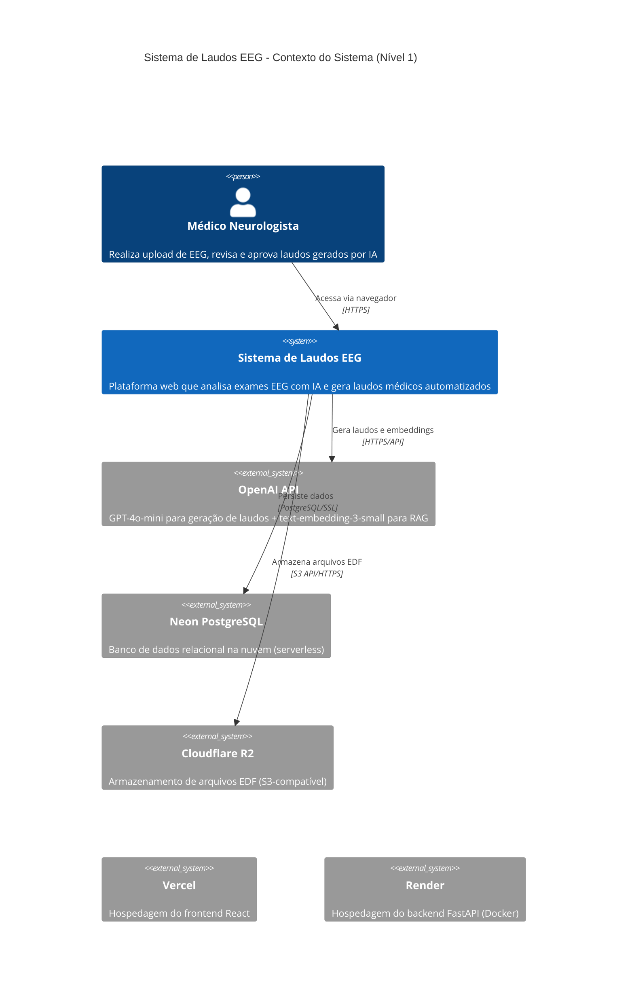
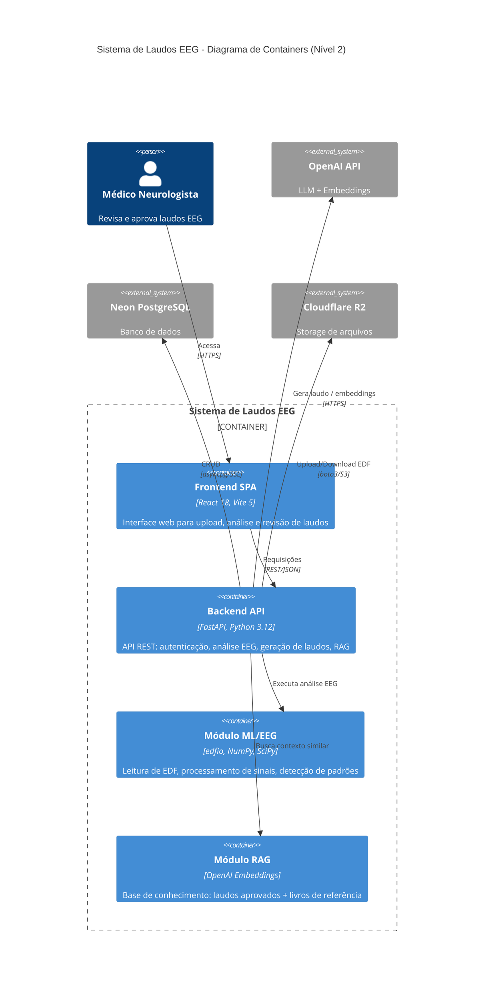
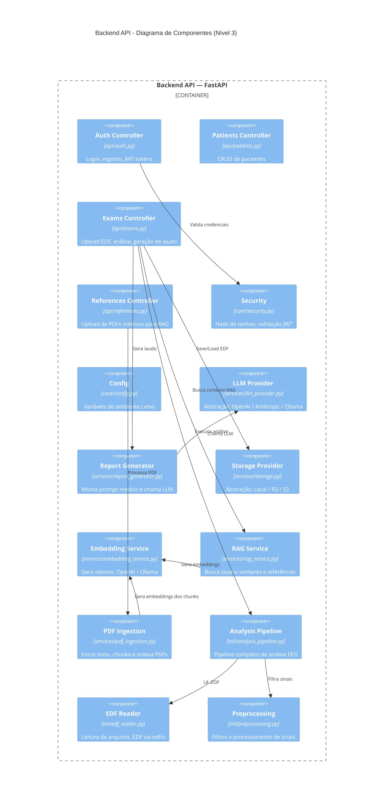
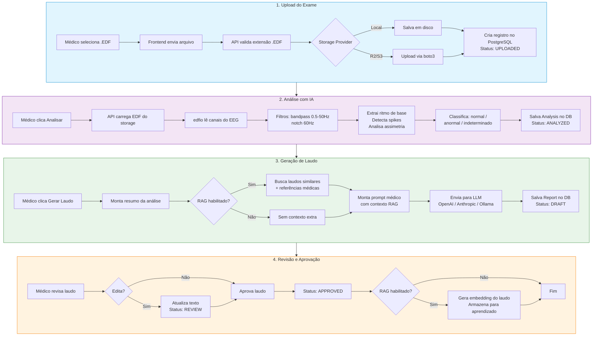
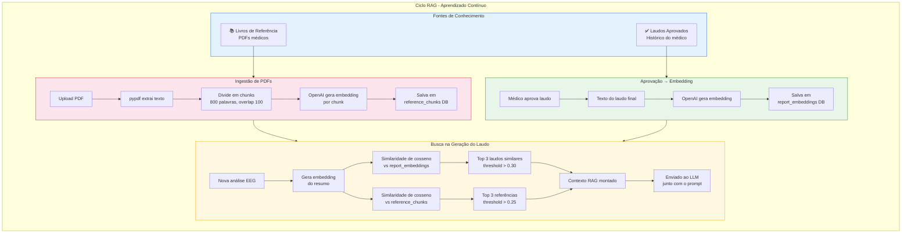
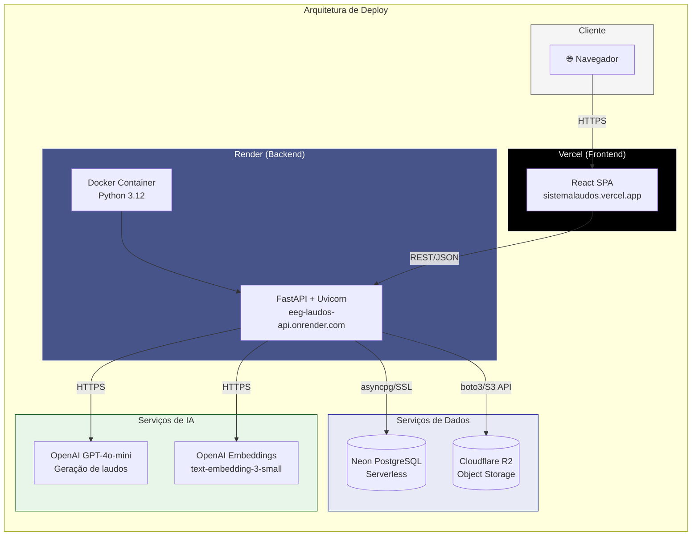
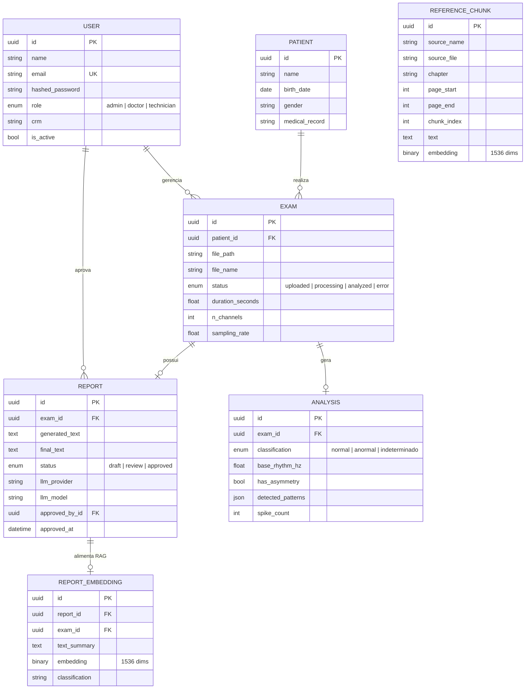
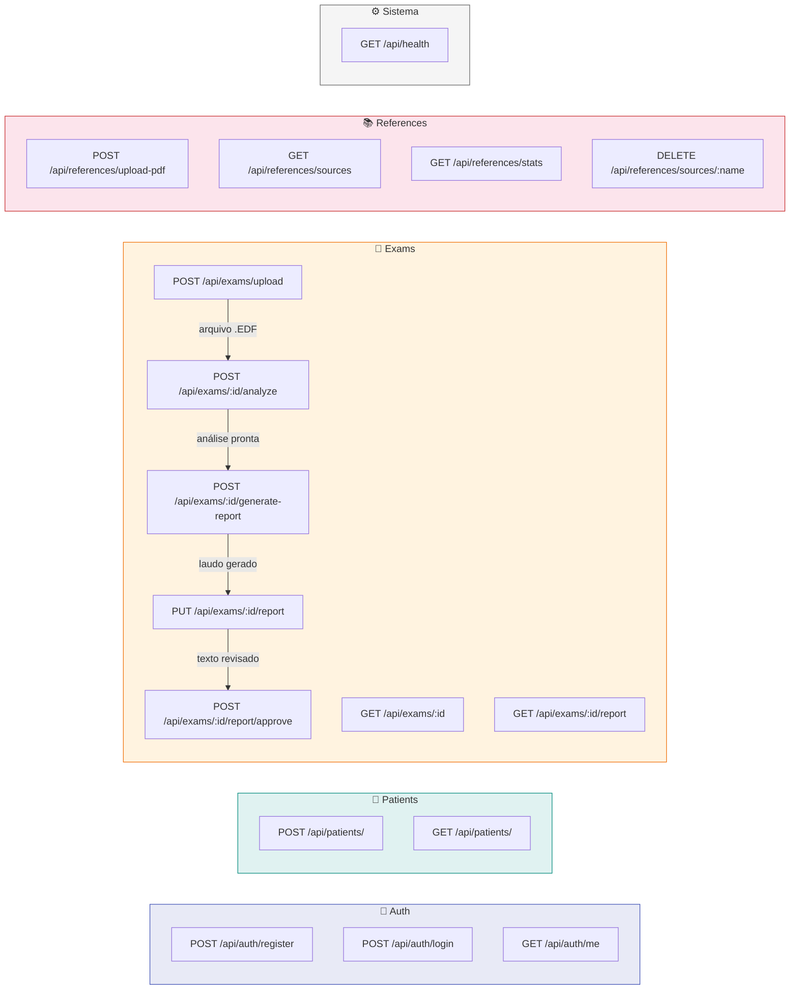
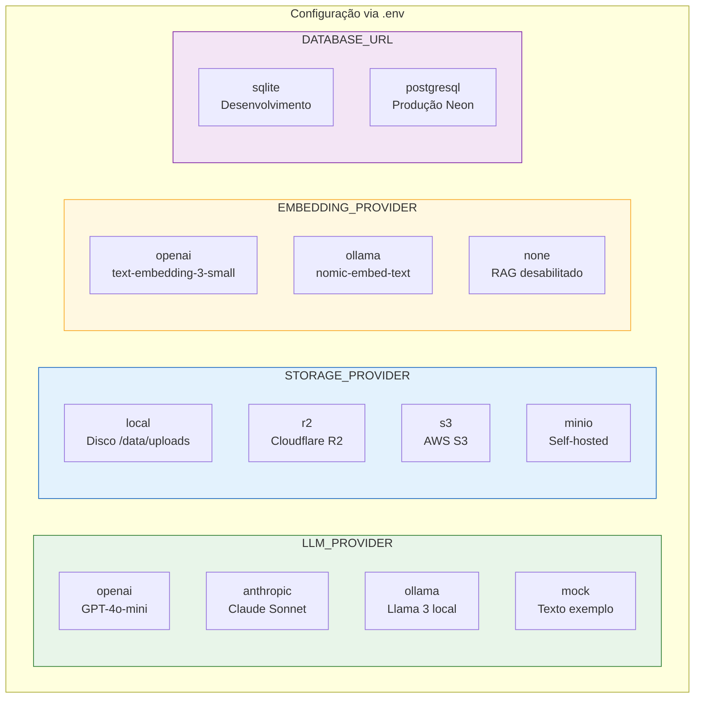

# 🧠 Sistema de Laudos EEG com IA — Documentação Arquitetural (C4 Model)

> Documentação baseada no [C4 Model](https://c4model.com) — uma abordagem de diagramação de arquitetura de software em 4 níveis de abstração.

---

## 📐 Nível 1 — Contexto do Sistema

Visão de alto nível: quem usa o sistema e com quais serviços externos ele se comunica.

**Decisões-chave:**
| Decisão | Motivo |
|---|---|
| OpenAI (única API key) | Serve tanto LLM (gpt-4o-mini) quanto Embeddings (text-embedding-3-small) |
| Neon PostgreSQL | Serverless, free tier generoso, compatível com asyncpg |
| Cloudflare R2 | 10 GB grátis, S3-compatível, sem egress fees |
| Render (Docker) | Deploy automático via GitHub, free tier para testes |
| Vercel | Deploy estático otimizado para React SPA |

---

## 📦 Nível 2 — Diagrama de Containers

Zoom no sistema: quais são os principais containers (aplicações/serviços) e como se comunicam.

**Tecnologias por container:**
| Container | Stack | Hospedagem |
|---|---|---|
| Frontend SPA | React 18 + Vite 5 + Axios | Vercel |
| Backend API | FastAPI + SQLAlchemy 2.0 + Pydantic | Render (Docker) |
| Módulo ML/EEG | edfio + NumPy + SciPy | Embarcado no backend |
| Módulo RAG | OpenAI Embeddings + Cosine Similarity | Embarcado no backend |

---

## 🔧 Nível 3 — Componentes do Backend

Zoom no container "Backend API": cada módulo e suas responsabilidades.

**Padrão Strategy (plugável via .env):**
| Abstração | Implementações | Variável |
|---|---|---|
| LLM Provider | OpenAI, Anthropic, Ollama, Mock | `LLM_PROVIDER` |
| Storage Provider | Local, Cloudflare R2, AWS S3, MinIO | `STORAGE_PROVIDER` |
| Embedding Provider | OpenAI, Ollama, None | `EMBEDDING_PROVIDER` |

---

## 🔄 Fluxo Principal — Do Upload à Aprovação

O fluxo completo de um exame EEG, passando por todas as etapas do sistema.

---

## 🧠 Fluxo RAG — Base de Conhecimento e Aprendizado Contínuo

Como o sistema aprende com laudos aprovados e referências médicas para gerar laudos cada vez melhores.

**Parâmetros RAG:**
| Parâmetro | Valor | Descrição |
|---|---|---|
| Modelo de Embedding | `text-embedding-3-small` | 1536 dimensões |
| Chunk size | 800 palavras | Com overlap de 100 palavras |
| Top-K laudos | 3 | Similaridade mínima: 0.30 |
| Top-K referências | 3 | Similaridade mínima: 0.25 |
| Batch size (ingestão) | 20 chunks/batch | Controle de memória |

---

## 🏗️ Arquitetura de Deploy

Infraestrutura em produção e comunicação entre serviços.

**URLs de produção:**
| Serviço | URL |
|---|---|
| Frontend | https://sistemalaudos.vercel.app |
| Backend API | https://eeg-laudos-api.onrender.com |
| API Docs (Swagger) | https://eeg-laudos-api.onrender.com/docs |
| Health Check | https://eeg-laudos-api.onrender.com/api/health |

---

## 🗄️ Modelo de Dados

Diagrama entidade-relacionamento com todas as tabelas do sistema.

---

## 📡 Mapa de Endpoints da API

---

## 🔑 Configurações Plugáveis (Strategy Pattern)

O sistema é totalmente parametrizável via variáveis de ambiente:

---

> **Referência:** Esta documentação segue o [C4 Model](https://c4model.com) de Simon Brown.
> Diagramas renderizados com [Mermaid.js](https://mermaid.js.org/) — compatíveis com GitHub, GitLab e VS Code.
